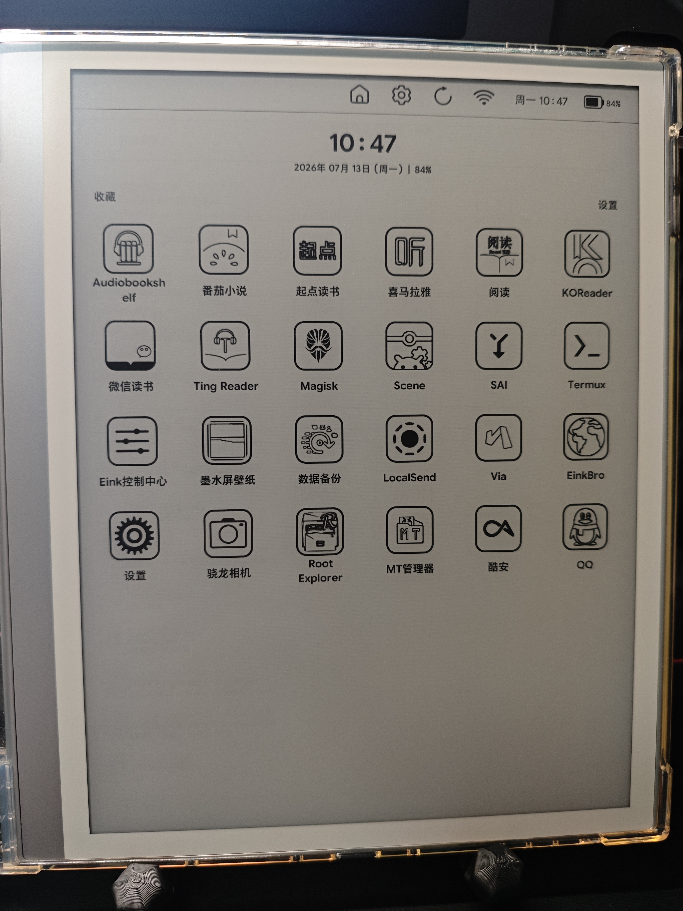

# E-ink Minimal Launcher

本次版本在原项目基础上进行了本地化与墨水屏体验优化，更新内容如下：
### 核心功能优化
* **全面汉化**：完成应用界面中文翻译。
* **墨水屏专属优化**：提升图标在墨水屏上的对比度与清晰度。

### 界面与排版
* **布局调整**：优化默认图标排版，提升桌面视觉整洁度。

### 个性化定制
* **字体与图标**：新增对自定义字体及第三方图标包的支持。
* **尺寸调节**：支持自由设定图标大小与文字大小。

<p align="center">
  
</p>


## Versioning
- **v1.4.0 中文优化版**：
    - 全面汉化：完成应用界面中文翻译。
    - 界面与排版：调整默认图标排版，提升视觉整洁度。
    - 个性化定制：新增自定义字体、第三方图标包支持，支持自由设定图标与文字大小。
    - 墨水屏增强：提升图标在墨水屏上的对比度与清晰度。
- **v1.4.0**: 
    - Complete E-ink UI optimization (forced light mode, high-contrast white theme for all dialogs).
    - Removed dialog shadows, frames, and animations to eliminate ghosting and black artifacts.
    - Increased settings button touch target (48dp) for better usability.
    - Refined index bar colors for maximum contrast.
- **v1.3.9**: Initial internal test for settings button fixes.
- **v1.3.7**: Fixed an issue where the scrolling app list overlapped with the top header in the "All Apps" view.
- **v1.3.6**: Fully localized the UI and settings menu based on the selected date language (Korean, English, Japanese).
- **v1.3.5**: Added a setting to choose the date language/format (Korean, English, Japanese).
- **v1.3.4**: Fixed a bug where the day of the week was displayed in English on some devices (e.g., Leaf 3) by forcing the Korean locale for date formatting.
- **v1.3.3**: Added a star (★) index to the top of the index bar in the "All Apps" view for quick access to favorite apps.
- **v1.3.2**: Changed default animation setting to 'off' for better compatibility with low-spec E-ink devices. Added option to enable it in settings.
- **v1.3.1**: Fixed an issue where certain manufacturer-specific apps (like Onyx Launcher) would not open.
- **v1.3.0**: Expanded column layout up to 5 columns (for tablets like Y700) and added an animation toggle setting for E-ink optimization (e.g., Boox Leaf 3).
- **v1.2.1**: Reduced index pop-out intensity and minor UI refinements.
- **v1.2**: Fixed index bar layering (always on top), refined "wave" pop-out visibility.
- **v1.1**: Added column selection (1/2/3), improved index bar aesthetics, and centered favorites layout.
- **v1.0**: Initial stable release.

## Installation

```bash
adb install e-ink-minimal-launcher-v1.4.0.apk
```

## License

MIT License - Copyright (c) 2026 bc1qwerty
